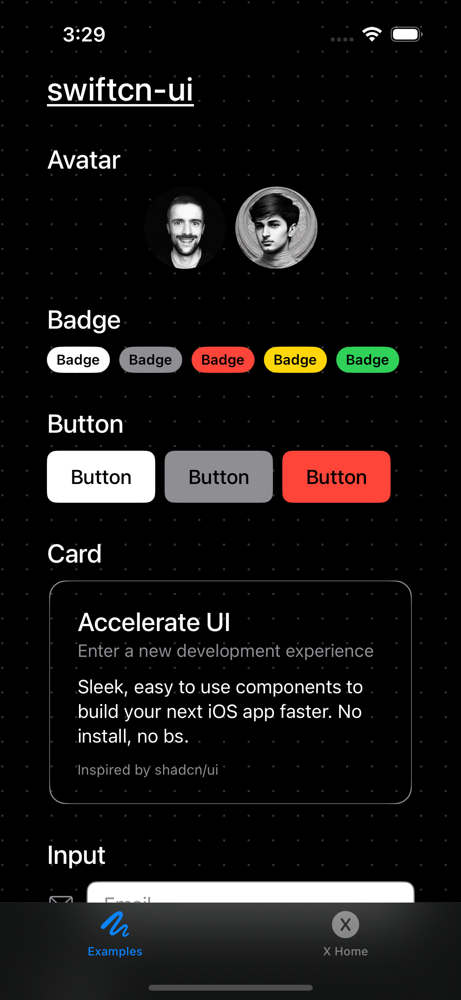
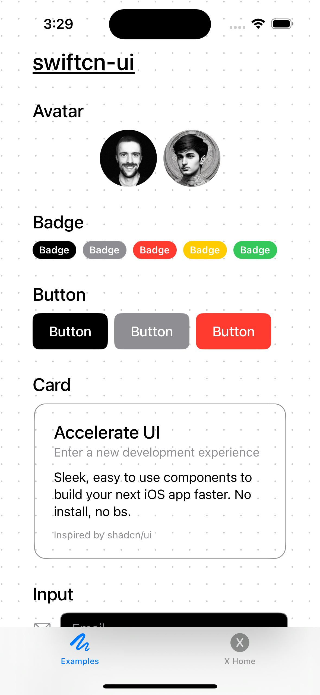
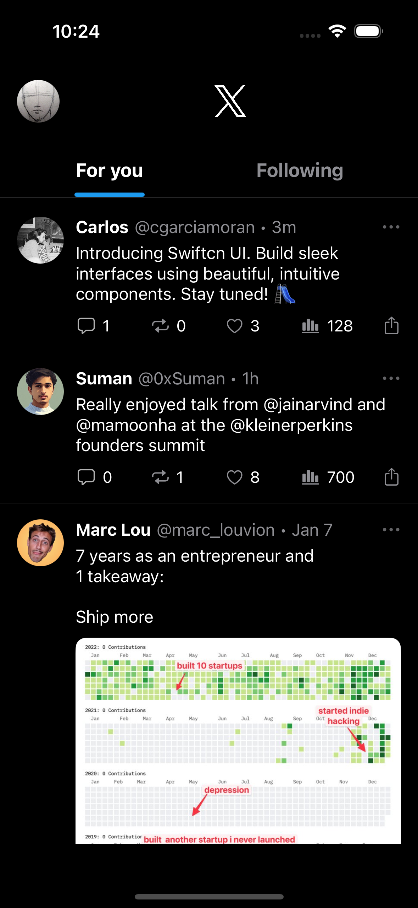
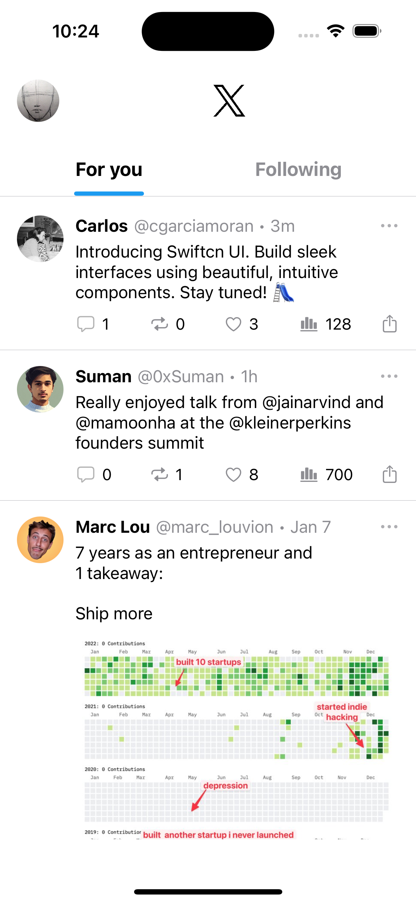

# swiftcn-ui | Swift playground

swiftcn-ui is a comprehensive library of components to **build beautiful iOS apps, fast**.

Sleek, ready-to-use components for your next SwiftUI project. No package install, no bs.

Inspired by [shadcn-ui](https://github.com/shadcn-ui/ui).

|          Dark mode           |          Light mode           |
| :--------------------------: | :---------------------------: |
|  |  |
|        |        |

## Usage

Check out the [docs](https://swiftcn.mintlify.app/introduction) to get started.

You can also run the playground locally:

1. `git clone git@github.com:Mobilecn-UI/swiftcn-ui.git`
2. Open Xcode -> `Open a project or file`
3. Select `Swiftcn Playground.swiftpm` under `swiftcn-ui`
4. Slide 🛝

## Components

- [x] Avatar
- [x] Badge
- [x] Button
- [x] Input
- [x] Slider
- [x] Tabs
- [ ] Card (WIP)
- [ ] Calendar (WIP)

## Examples

- [x] X Home
- [ ] Spotify (WIP)

## Contributing

Check out the [contributing guide](https://github.com/Mobilecn-UI/swiftcn-ui/blob/main/CONTRIBUTING.md).

## License

Distributed under the [MIT license](https://github.com/Mobilecn-UI/swiftcn-ui/blob/main/LICENSE).
