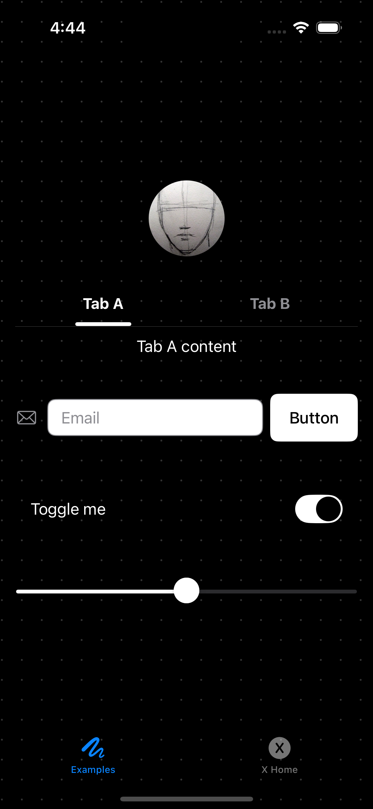
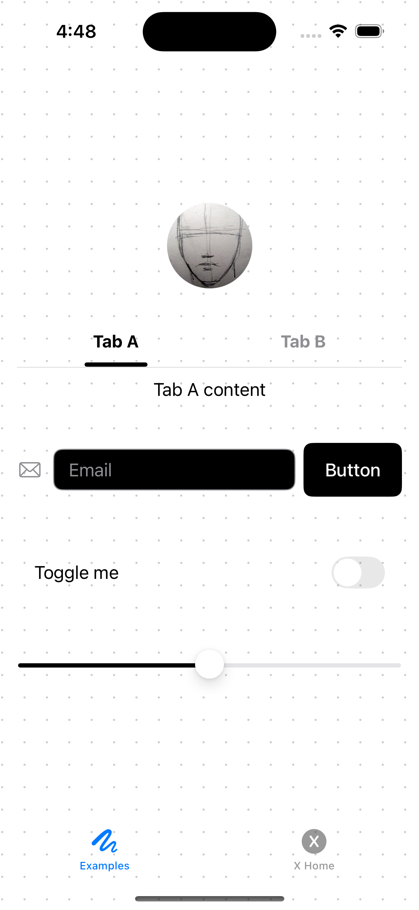

# Swiftcn UI | Swift playground

Swiftcn UI is a comprehensive library of components to **build beautiful iOS apps, fast**.

Inspired by [shadcn-ui](https://github.com/shadcn-ui/ui)

## Documentation

Visit [Swiftcn UI](https://swiftcn.mintlify.app/introduction) to get started.

|         Dark mode         |         Light mode         |
| :-----------------------: | :------------------------: |
|  |  |
|     |     |

## Usage

1. `git clone git@github.com:Swiftcn-UI/swiftcn-playground.git`
2. Open Xcode -> `Open a project or file`
3. Select `Swiftcn Playground.swiftpm` under `swiftcn-playground`
4. Slide 🛝

## Components

- [x] Avatar
- [x] Badge
- [x] Button
- [x] Input
- [x] Slider
- [x] Tabs
- [ ] Card (WIP)

## Examples

- [x] X Home
- [ ] Spotify (WIP)
