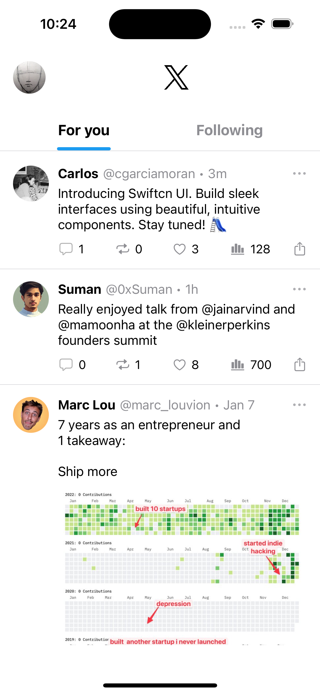

# Swiftcn UI | Swift playground

Swiftcn UI is a comprehensive library of components to **build beautiful iOS apps, fast**.

Inspired by [shadcn-ui](https://github.com/shadcn-ui/ui)

## Documentation

Visit [Swiftcn UI](https://swiftcn.mintlify.app/introduction) to get started.

|     X Home - dark mode      |     X Home - light mode      |
| :-------------------------: | :--------------------------: |
|  |  |

## Usage

1. `git clone git@github.com:Swiftcn-UI/swiftcn-playground.git`
2. Open Xcode -> `Open a project or file`
3. Select `Swiftcn Playground.swiftpm` under `swiftcn-playground`
4. Slide 🛝

## Components

- [x] Avatar
- [x] Button
- [x] Input
- [x] Slider
- [ ] Badge (WIP)
- [ ] Tabs

## Examples

- [x] X Home
- [ ] Spotify (WIP)
